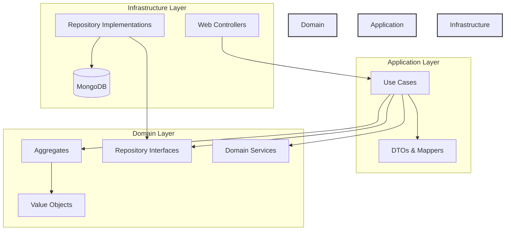
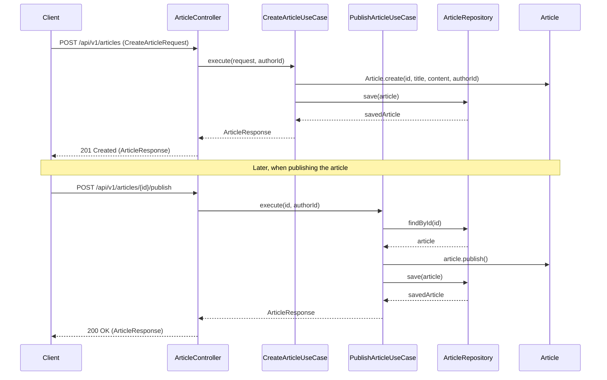

# Blog Application with Spring Boot 3.5 and Domain-Driven Design

This project is a blog application built with Spring Boot 3.5 following Domain-Driven Design (DDD) principles. It provides a robust architecture for managing blog content with a focus on maintainability, scalability, and alignment with business needs.

## Table of Contents

1. [Introduction](#introduction)
2. [Domain-Driven Design Architecture](#domain-driven-design-architecture)
   1. [Architecture Diagram](#architecture-diagram)
   2. [Sequence Diagram: Article Creation and Publishing](#sequence-diagram-article-creation-and-publishing)
   3. [Detailed Architecture SVG Diagram](#detailed-architecture-svg-diagram)
   4. [Key DDD Concepts Implemented](#key-ddd-concepts-implemented)
3. [Getting Started](#getting-started)
4. [Project Structure](#project-structure)
5. [Key Features](#key-features)
6. [API Documentation](#api-documentation)
7. [Testing](#testing)
8. [Development Guidelines](#development-guidelines)
9. [Contributing](#contributing)

## Introduction

This blog application demonstrates the implementation of Domain-Driven Design principles in a Spring Boot application. It provides functionality for creating, updating, publishing, and archiving blog articles, with a rich domain model that encapsulates business rules and invariants.

## Domain-Driven Design Architecture

The application follows a hexagonal architecture (ports and adapters) with clear separation of concerns:

- **Domain Layer**: Contains the core business logic, entities, value objects, and domain services
- **Application Layer**: Orchestrates the flow of domain objects to accomplish specific use cases
- **Infrastructure Layer**: Implements technical capabilities that support the higher layers

### Architecture Diagram

The following diagram illustrates the hexagonal architecture of the application:



### Sequence Diagram: Article Creation and Publishing

The following sequence diagram illustrates the flow of creating and publishing an article:



### Key DDD Concepts Implemented

- **Aggregates**: Article is the main aggregate root
- **Value Objects**: ArticleId, Title, Slug, Content, AuthorId
- **Repositories**: ArticleRepository with MongoDB implementation
- **Domain Services**: ArticleSlugService, ArticleValidationService
- **Application Services**: Use cases for creating, updating, publishing articles

### Detailed Architecture SVG Diagram

The following SVG diagram provides a detailed view of the application's architecture and DDD concepts:

<svg width="800" height="600" xmlns="http://www.w3.org/2000/svg">
  <!-- Background -->
  <rect width="800" height="600" fill="#f8f9fa" />

  <!-- Title -->
  <text x="400" y="30" font-family="Arial" font-size="24" text-anchor="middle" font-weight="bold">Blog Application Architecture with DDD</text>

  <!-- Infrastructure Layer -->
  <rect x="50" y="70" width="700" height="150" fill="#d1f7c4" stroke="#333" stroke-width="2" rx="10" />
  <text x="400" y="95" font-family="Arial" font-size="18" text-anchor="middle" font-weight="bold">Infrastructure Layer</text>

  <!-- Web Controllers -->
  <rect x="80" y="120" width="180" height="80" fill="#ffffff" stroke="#333" stroke-width="1" rx="5" />
  <text x="170" y="145" font-family="Arial" font-size="14" text-anchor="middle" font-weight="bold">Web Controllers</text>
  <text x="170" y="165" font-family="Arial" font-size="12" text-anchor="middle">ArticleController</text>
  <text x="170" y="185" font-family="Arial" font-size="12" text-anchor="middle">REST API Endpoints</text>

  <!-- Repository Implementations -->
  <rect x="310" y="120" width="180" height="80" fill="#ffffff" stroke="#333" stroke-width="1" rx="5" />
  <text x="400" y="145" font-family="Arial" font-size="14" text-anchor="middle" font-weight="bold">Repository Implementations</text>
  <text x="400" y="165" font-family="Arial" font-size="12" text-anchor="middle">ArticleRepositoryImpl</text>
  <text x="400" y="185" font-family="Arial" font-size="12" text-anchor="middle">MongoArticleRepository</text>

  <!-- External Systems -->
  <rect x="540" y="120" width="180" height="80" fill="#ffffff" stroke="#333" stroke-width="1" rx="5" />
  <text x="630" y="145" font-family="Arial" font-size="14" text-anchor="middle" font-weight="bold">External Systems</text>
  <text x="630" y="165" font-family="Arial" font-size="12" text-anchor="middle">MongoDB</text>
  <text x="630" y="185" font-family="Arial" font-size="12" text-anchor="middle">External Services</text>

  <!-- Application Layer -->
  <rect x="50" y="240" width="700" height="150" fill="#c9daf8" stroke="#333" stroke-width="2" rx="10" />
  <text x="400" y="265" font-family="Arial" font-size="18" text-anchor="middle" font-weight="bold">Application Layer</text>

  <!-- Use Cases -->
  <rect x="80" y="290" width="320" height="80" fill="#ffffff" stroke="#333" stroke-width="1" rx="5" />
  <text x="240" y="315" font-family="Arial" font-size="14" text-anchor="middle" font-weight="bold">Use Cases</text>
  <text x="240" y="335" font-family="Arial" font-size="12" text-anchor="middle">CreateArticleUseCase, UpdateArticleUseCase</text>
  <text x="240" y="355" font-family="Arial" font-size="12" text-anchor="middle">PublishArticleUseCase, ListArticlesUseCase</text>

  <!-- DTOs & Mappers -->
  <rect x="430" y="290" width="290" height="80" fill="#ffffff" stroke="#333" stroke-width="1" rx="5" />
  <text x="575" y="315" font-family="Arial" font-size="14" text-anchor="middle" font-weight="bold">DTOs & Mappers</text>
  <text x="575" y="335" font-family="Arial" font-size="12" text-anchor="middle">ArticleResponse, CreateArticleRequest</text>
  <text x="575" y="355" font-family="Arial" font-size="12" text-anchor="middle">ArticleMapper</text>

  <!-- Domain Layer -->
  <rect x="50" y="410" width="700" height="170" fill="#f8cecc" stroke="#333" stroke-width="2" rx="10" />
  <text x="400" y="435" font-family="Arial" font-size="18" text-anchor="middle" font-weight="bold">Domain Layer</text>

  <!-- Aggregates -->
  <rect x="80" y="460" width="150" height="100" fill="#ffffff" stroke="#333" stroke-width="1" rx="5" />
  <text x="155" y="485" font-family="Arial" font-size="14" text-anchor="middle" font-weight="bold">Aggregates</text>
  <text x="155" y="505" font-family="Arial" font-size="12" text-anchor="middle">Article</text>
  <text x="155" y="525" font-family="Arial" font-size="12" text-anchor="middle">(Aggregate Root)</text>

  <!-- Value Objects -->
  <rect x="250" y="460" width="150" height="100" fill="#ffffff" stroke="#333" stroke-width="1" rx="5" />
  <text x="325" y="485" font-family="Arial" font-size="14" text-anchor="middle" font-weight="bold">Value Objects</text>
  <text x="325" y="505" font-family="Arial" font-size="12" text-anchor="middle">ArticleId, Title</text>
  <text x="325" y="525" font-family="Arial" font-size="12" text-anchor="middle">Slug, Content</text>
  <text x="325" y="545" font-family="Arial" font-size="12" text-anchor="middle">AuthorId</text>

  <!-- Repository Interfaces -->
  <rect x="420" y="460" width="150" height="100" fill="#ffffff" stroke="#333" stroke-width="1" rx="5" />
  <text x="495" y="485" font-family="Arial" font-size="14" text-anchor="middle" font-weight="bold">Repository Interfaces</text>
  <text x="495" y="505" font-family="Arial" font-size="12" text-anchor="middle">ArticleRepository</text>
  <text x="495" y="525" font-family="Arial" font-size="12" text-anchor="middle">(Port)</text>

  <!-- Domain Services -->
  <rect x="590" y="460" width="150" height="100" fill="#ffffff" stroke="#333" stroke-width="1" rx="5" />
  <text x="665" y="485" font-family="Arial" font-size="14" text-anchor="middle" font-weight="bold">Domain Services</text>
  <text x="665" y="505" font-family="Arial" font-size="12" text-anchor="middle">ArticleSlugService</text>
  <text x="665" y="525" font-family="Arial" font-size="12" text-anchor="middle">ArticleValidationService</text>

  <!-- Arrows -->
  <!-- Infrastructure to Application -->
  <line x1="170" y1="200" x2="240" y2="290" stroke="#333" stroke-width="2" marker-end="url(#arrowhead)" />
  <line x1="400" y1="200" x2="495" y2="460" stroke="#333" stroke-width="2" marker-end="url(#arrowhead)" />
  <line x1="630" y1="200" x2="400" y2="290" stroke="#333" stroke-width="2" marker-end="url(#arrowhead)" />

  <!-- Application to Domain -->
  <line x1="240" y1="370" x2="155" y2="460" stroke="#333" stroke-width="2" marker-end="url(#arrowhead)" />
  <line x1="240" y1="370" x2="325" y2="460" stroke="#333" stroke-width="2" marker-end="url(#arrowhead)" />
  <line x1="240" y1="370" x2="495" y2="460" stroke="#333" stroke-width="2" marker-end="url(#arrowhead)" />
  <line x1="240" y1="370" x2="665" y2="460" stroke="#333" stroke-width="2" marker-end="url(#arrowhead)" />

  <!-- Domain internal relationships -->
  <line x1="155" y1="510" x2="250" y2="510" stroke="#333" stroke-width="2" marker-end="url(#arrowhead)" />
  <line x1="155" y1="520" x2="420" y2="520" stroke="#333" stroke-width="2" marker-end="url(#arrowhead)" />
  <line x1="665" y1="510" x2="570" y2="510" stroke="#333" stroke-width="2" marker-end="url(#arrowhead)" />

  <!-- Arrowhead definition -->
  <defs>
    <marker id="arrowhead" markerWidth="10" markerHeight="7" refX="9" refY="3.5" orient="auto">
      <polygon points="0 0, 10 3.5, 0 7" fill="#333" />
    </marker>
  </defs>
</svg>

## Getting Started

### Prerequisites

- Java 21
- MongoDB (or Docker for the included Docker Compose setup)
- Gradle

### Running the Application

1. Clone the repository
2. Start MongoDB:
   ```
   docker-compose up -d
   ```
3. Run the application:
   ```
   ./gradlew bootRun
   ```
4. The application will be available at http://localhost:8080

## Project Structure

The project follows a DDD-oriented directory structure:

```
src/
 ├── main/
 │   ├── java/
 │   │   └── app/quantun/blog/
 │   │       ├── BlogApplication.java (Main entry point)
 │   │       ├── shared/
 │   │       │   ├── domain/
 │   │       │   │   ├── AggregateRoot.java
 │   │       │   │   ├── ValueObject.java
 │   │       │   │   └── DomainException.java
 │   │       ├── content/              (Bounded Context)
 │   │       │   ├── domain/
 │   │       │   │   ├── model/        (Entities, Value Objects)
 │   │       │   │   ├── repository/   (Repository interfaces)
 │   │       │   │   └── service/      (Domain Services)
 │   │       │   ├── application/
 │   │       │   │   ├── usecase/      (Use Cases)
 │   │       │   │   └── ArticleMapper.java
 │   │       │   ├── infrastructure/
 │   │       │   │   ├── persistence/  (Repository implementations)
 │   │       │   │   └── web/          (Controllers)
 │   │       │   └── dto/              (Data Transfer Objects)
 │   └── resources/
 │       └── application.properties
 └── test/
     └── java/
         └── app/quantun/blog/
```

## Key Features

- **Article Management**: Create, update, publish, and archive articles
- **Tagging System**: Add and remove tags from articles
- **Validation**: Domain-level validation of business rules
- **MongoDB Integration**: Persistence using MongoDB

## API Documentation

The API provides the following endpoints:

- `POST /api/v1/articles` - Create a new article
- `GET /api/v1/articles/{id}` - Get article by ID
- `GET /api/v1/articles/slug/{slug}` - Get article by slug
- `PUT /api/v1/articles/{id}` - Update an article
- `POST /api/v1/articles/{id}/publish` - Publish an article
- `GET /api/v1/articles` - List articles with pagination and filtering

## Testing

The project includes various types of tests:

- **Domain Tests**: Test business rules and invariants
- **Use Case Tests**: Test application services
- **Infrastructure Tests**: Test controllers and repository implementations

Run tests with:
```
./gradlew test
```

## Development Guidelines

When contributing to this project, please follow these guidelines:

- **Domain Model**: Keep the domain model rich and focused on business rules
- **Use Cases**: Implement one class per use case following the Single Responsibility Principle
- **Controllers**: Keep controllers thin, focusing only on HTTP concerns
- **Testing**: Write tests for all layers of the application
- **Documentation**: Document domain decisions and the reasoning behind them

## Contributing

Contributions are welcome! Please feel free to submit a Pull Request.

1. Fork the repository
2. Create your feature branch (`git checkout -b feature/amazing-feature`)
3. Commit your changes (`git commit -m 'Add some amazing feature'`)
4. Push to the branch (`git push origin feature/amazing-feature`)
5. Open a Pull Request
