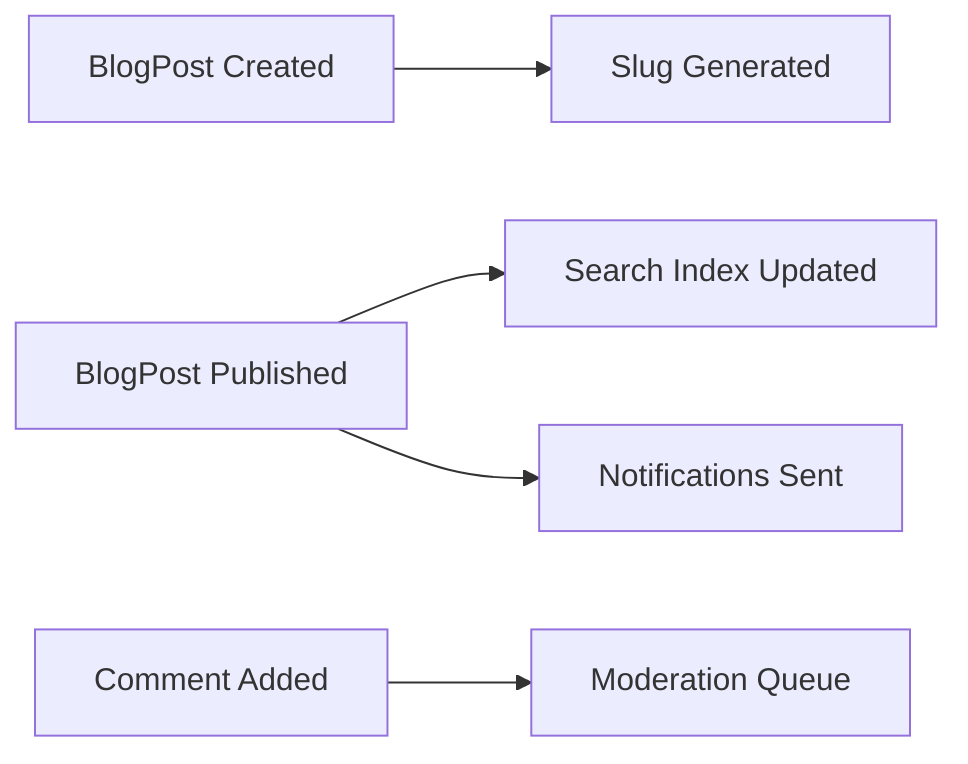

# 📝 Blog Application with Hexagonal Architecture

[](https://spring.io/projects/spring-boot)
[](https://openjdk.java.net/projects/jdk/21/)
[](https://www.mongodb.com/)
[](LICENSE)

## 📖 Table of Contents

1. [Introduction](#-introduction)
2. [Architecture Overview](#-architecture-overview)
3. [Domain Model](#-domain-model)
4. [Technology Stack](#-technology-stack)
5. [Directory Structure](#-directory-structure)
6. [Getting Started](#-getting-started)
7. [API Endpoints](#-api-endpoints)
8. [Testing Strategy](#-testing-strategy)
9. [Performance & Optimization](#-performance--optimization)
10. [Contributing](#-contributing)

## 🎯 Introduction

A modern, production-ready blog application built with **Spring Boot 3.5.3** following **Hexagonal Architecture** (Ports and Adapters) principles. This application demonstrates best practices for Domain-Driven Design (DDD), clean architecture, and microservices patterns.

### ✨ Key Features

- 📝 **Blog Post Management**: Create, update, publish, and archive articles
- 👥 **Author Management**: Complete author lifecycle with email validation
- 💬 **Comment System**: Rich commenting with moderation capabilities
- 🏷️ **Tagging System**: Flexible tagging for content categorization
- 🔒 **Domain-Driven Design**: Immutable entities with strong consistency
- 🎯 **Type Safety**: Custom value objects for enhanced validation
- ⚡ **Performance Optimized**: Caching, pagination, and efficient queries

## 🏗️ Architecture Overview

This application implements **Hexagonal Architecture** to achieve maximum flexibility, testability, and maintainability. The architecture ensures that business logic remains isolated from external concerns.

```
┌─────────────────────────────────────────────────────────────┐
│                    Infrastructure Layer                     │
│  ┌─────────────────┐                   ┌─────────────────┐  │
│  │   Web Adapters  │                   │ Persistence     │  │
│  │  (Controllers)  │                   │   Adapters      │  │
│  └─────────────────┘                   └─────────────────┘  │
└─────────────────────────────────────────────────────────────┘
                              │
┌─────────────────────────────────────────────────────────────┐
│                    Application Layer                        │
│  ┌─────────────────┐       ┌─────────────────┐             │
│  │   Use Cases     │       │   Application   │             │
│  │  (Services)     │       │    Services     │             │
│  └─────────────────┘       └─────────────────┘             │
└─────────────────────────────────────────────────────────────┘
                              │
┌─────────────────────────────────────────────────────────────┐
│                      Domain Layer                           │
│  ┌─────────────────┐       ┌─────────────────┐             │
│  │    Entities     │       │ Value Objects   │             │
│  │   (BlogPost,    │       │  (Email, Slug,  │             │
│  │    Author)      │       │   AuthorId)     │             │
│  └─────────────────┘       └─────────────────┘             │
└─────────────────────────────────────────────────────────────┘
```

### 🎯 Architecture Principles

| Principle | Implementation | Benefit |
|-----------|----------------|---------|
| **Dependency Inversion** | All dependencies point toward the domain | Flexibility & Testability |
| **Single Responsibility** | Each layer has a clear, focused purpose | Maintainability |
| **Domain Isolation** | Business logic free from technical concerns | Domain Integrity |
| **Immutability** | Entities return new instances instead of mutating | Thread Safety |
| **Type Safety** | Custom value objects for all identifiers | Compile-time Validation |

## 🧠 Domain Model

### 📊 Core Entities & Value Objects

| Entity/Value Object | Purpose | Key Behaviors |
|---------------------|---------|---------------|
| `BlogPost` | Core content entity | Create, publish, archive, add tags/comments |
| `Author` | Content creator | Create, update profile information |
| `Comment` | User feedback | Add to posts with moderation |
| `Tag` | Content categorization | Organize and filter content |
| `AuthorId` | Type-safe author identifier | Generate, validate |
| `PostId` | Type-safe post identifier | Generate, validate |
| `Email` | Validated email address | Format validation |
| `Slug` | URL-friendly identifier | Generate from titles |

### 🔄 Domain Events



## 🛠️ Technology Stack

### Core Framework
| Technology | Version | Purpose |
|------------|---------|---------|
| **Spring Boot** | 3.5.3 | Application framework |
| **Java** | 21 | Programming language |
| **Spring Data MongoDB** | 3.5.x | Data access layer |
| **Spring Validation** | 3.5.x | Input validation |

### Development & Quality
| Technology | Purpose |
|------------|---------|
| **Lombok** | Reduce boilerplate code |
| **MapStruct** | Type-safe object mapping |
| **SpringDoc OpenAPI** | API documentation |
| **SLF4J + Logback** | Structured logging |

### Testing & DevOps
| Technology | Purpose |
|------------|---------|
| **JUnit 5** | Unit testing framework |
| **Testcontainers** | Integration testing |
| **MockMvc** | Web layer testing |
| **ArchUnit** | Architecture validation |

## 📁 Directory Structure

```
src/main/java/app/quantun/blog/
├── 📁 shared/                          # Cross-cutting concerns
│   ├── valueobject/                    # Shared value objects
│   │   ├── Email.java                  # ✅ Email validation
│   │   └── Slug.java                   # ✅ URL-safe slugs
│   └── exception/                      # Domain exceptions
│       ├── AuthorNotFoundException.java
│       └── BlogPostNotFoundException.java
│
├── 📁 domain/                          # 🎯 Core business logic
│   └── model/                          # Domain entities
│       ├── BlogPost.java               # ✅ Immutable entity
│       ├── Author.java                 # ✅ Immutable entity
│       ├── AuthorId.java               # ✅ Type-safe ID
│       ├── PostId.java                 # ✅ Type-safe ID
│       ├── Comment.java
│       ├── Tag.java
│       └── PostStatus.java
│
├── 📁 application/                     # 🔄 Orchestration layer
│   ├── port/
│   │   ├── in/                         # Input ports (Use Cases)
│   │   │   ├── CreateBlogPostUseCase.java
│   │   │   ├── GetBlogPostUseCase.java
│   │   │   ├── PublishBlogPostUseCase.java
│   │   │   ├── CreateAuthorUseCase.java
│   │   │   ├── GetAuthorUseCase.java
│   │   │   └── AddCommentUseCase.java
│   │   └── out/                        # Output ports
│   │       ├── BlogPostRepositoryPort.java
│   │       ├── AuthorRepositoryPort.java
│   │       ├── CommentRepositoryPort.java
│   │       └── TagRepositoryPort.java
│   └── service/                        # Application services
│       ├── BlogPostApplicationService.java # ✅ Updated for immutability
│       ├── AuthorApplicationService.java   # ✅ Updated for AuthorId
│       └── CommentApplicationService.java
│
└── 📁 infrastructure/                  # 🔌 External adapters
    ├── adapter/
    │   ├── in/web/                     # HTTP adapters
    │   │   ├── BlogPostController.java # ✅ Updated endpoints
    │   │   ├── AuthorController.java   # ✅ AuthorId integration
    │   │   ├── CommentController.java
    │   │   ├── GlobalExceptionHandler.java
    │   │   └── contract/               # API contracts
    │   │       ├── request/            # Request DTOs
    │   │       └── response/           # Response DTOs
    │   └── out/persistence/mongo/      # MongoDB adapters
    │       ├── adapter/                # Repository implementations
    │       │   ├── BlogPostRepositoryAdapter.java # ✅ Updated for AuthorId
    │       │   ├── AuthorRepositoryAdapter.java   # ✅ Updated for AuthorId
    │       │   ├── CommentRepositoryAdapter.java
    │       │   └── TagRepositoryAdapter.java
    │       ├── entity/                 # MongoDB entities
    │       ├── mapper/                 # Entity mappers
    │       └── repository/             # Spring Data repositories
    └── config/
        ├── BeanConfiguration.java      # ✅ Simplified configuration
        └── OpenApiConfig.java
```

## 🚀 Getting Started

### 📋 Prerequisites

| Requirement | Version | Download |
|-------------|---------|----------|
| **Java** | 21+ | [OpenJDK](https://openjdk.java.net/projects/jdk/21/) |
| **Docker** | Latest | [Docker Desktop](https://www.docker.com/products/docker-desktop) |
| **Gradle** | 8.x | Included wrapper |

### 🏃‍♂️ Quick Start

1. **Clone the repository**
   ```bash
   git clone <repository-url>
   cd blog-hexagonal-architecture
   ```

2. **Start MongoDB with Docker**
   ```bash
   docker run -d --name blog-mongo -p 27017:27017 mongo:5.0
   ```

3. **Run the application**
   ```bash
   ./gradlew bootRun
   ```

4. **Access the application**
   - 🌐 **API**: http://localhost:8080
   - 📚 **Documentation**: http://localhost:8080/swagger-ui.html
   - 🗄️ **Database**: MongoDB on localhost:27017

### ⚙️ Configuration

```yaml
# application.yml
spring:
  data:
    mongodb:
      host: localhost
      port: 27017
      database: blog

logging:
  level:
    app.quantun.blog: DEBUG
    
management:
  endpoints:
    web:
      exposure:
        include: health,info,metrics
```

## 🌐 API Endpoints

### 📝 Blog Posts

| Method | Endpoint | Description | Status |
|--------|----------|-------------|---------|
| `POST` | `/api/posts` | Create new blog post | ✅ |
| `GET` | `/api/posts/{id}` | Get post by ID | ✅ |
| `GET` | `/api/posts/slug/{slug}` | Get post by slug | ✅ |
| `GET` | `/api/posts` | List published posts | ✅ |
| `GET` | `/api/posts/author/{authorId}` | Posts by author | ✅ |
| `PUT` | `/api/posts/{id}/publish` | Publish post | ✅ |

### 👥 Authors

| Method | Endpoint | Description | Status |
|--------|----------|-------------|---------|
| `POST` | `/api/authors` | Create new author | ✅ |
| `GET` | `/api/authors/{id}` | Get author by ID | ✅ |

### 💬 Comments

| Method | Endpoint | Description | Status |
|--------|----------|-------------|---------|
| `POST` | `/api/posts/{postId}/comments` | Add comment | ✅ |
| `GET` | `/api/posts/{postId}/comments` | List comments | ✅ |

### 📊 Example Requests

<details>
<summary>Create Blog Post</summary>

```json
POST /api/posts
{
  "title": "Introduction to Hexagonal Architecture",
  "content": "Hexagonal Architecture, also known as Ports and Adapters...",
  "summary": "Learn the fundamentals of Hexagonal Architecture",
  "authorId": "author-123",
  "tags": ["architecture", "design-patterns", "spring-boot"]
}
```

Response:
```json
{
  "id": "post-456",
  "title": "Introduction to Hexagonal Architecture",
  "slug": "introduction-to-hexagonal-architecture",
  "content": "Hexagonal Architecture, also known as Ports and Adapters...",
  "summary": "Learn the fundamentals of Hexagonal Architecture",
  "authorId": "author-123",
  "status": "DRAFT",
  "tags": ["architecture", "design-patterns", "spring-boot"],
  "createdAt": "2024-01-15T10:30:00Z",
  "updatedAt": "2024-01-15T10:30:00Z",
  "publishedAt": null
}
```
</details>

## 🧪 Testing Strategy

### 🔧 Testing Pyramid

```
              /\
             /  \
            /    \
           / E2E  \     <- Integration Tests
          /________\
         /          \
        /    API     \   <- Controller Tests  
       /______________\
      /                \
     /   Unit Tests     \ <- Domain & Service Tests
    /____________________\
```

### 📊 Test Coverage Goals

| Layer | Coverage Target | Focus |
|-------|----------------|-------|
| **Domain** | 95%+ | Business logic & rules |
| **Application** | 90%+ | Use case orchestration |
| **Infrastructure** | 80%+ | Adapter implementations |

### 🏃‍♂️ Running Tests

```bash
# Run all tests
./gradlew test

# Run specific test types
./gradlew test --tests "*UnitTest"
./gradlew test --tests "*IntegrationTest"

# Generate coverage report
./gradlew jacocoTestReport
```

### 🔍 Architecture Validation

```java
@AnalyzeClasses(packages = "app.quantun.blog")
class ArchitectureTest {
    
    @ArchTest
    static final ArchRule domainShouldNotDependOnInfrastructure =
        noClasses().that().resideInAPackage("..domain..")
            .should().dependOnClassesThat().resideInAPackage("..infrastructure..");
            
    @ArchTest
    static final ArchRule entitiesShouldBeImmutable =
        classes().that().resideInAPackage("..domain.model..")
            .should().haveOnlyFinalFields();
}
```

## ⚡ Performance & Optimization

### 📈 Performance Metrics

| Operation | Target Response Time | Optimization Strategy |
|-----------|---------------------|----------------------|
| **Create Post** | < 200ms | Domain validation + async processing |
| **Get Post** | < 100ms | Caching + database indexes |
| **List Posts** | < 150ms | Pagination + projection queries |
| **Search Posts** | < 300ms | Search indexes + result caching |

### 🚀 Optimization Features

- ✅ **Immutable Entities**: Thread-safe, cacheable domain objects
- ✅ **Type-Safe IDs**: Compile-time validation without runtime overhead
- ✅ **Efficient Queries**: Projection-based queries for list operations
- ✅ **Strategic Caching**: Domain-specific caching with proper invalidation
- ✅ **Async Processing**: Non-blocking operations for heavy tasks

### 📊 Monitoring & Observability

```yaml
# Actuator endpoints enabled
management:
  endpoints:
    web:
      exposure:
        include: health,info,metrics,prometheus
  metrics:
    export:
      prometheus:
        enabled: true
```

## 🎯 Recent Improvements

### ✅ Architecture Corrections Applied

| Issue | Solution | Benefit |
|-------|----------|---------|
| **Mutable Entities** | Implemented immutable domain objects | Thread safety & consistency |
| **String-based IDs** | Created `AuthorId` value object | Type safety & validation |
| **Bean Configuration** | Simplified Spring configuration | Reduced complexity |
| **Collection Safety** | Used `Set.copyOf()` & `List.copyOf()` | Immutable collections |

### 🔄 Migration Guide

For existing data, the following migrations may be needed:

1. **AuthorId Migration**: Update existing author references
2. **Entity Updates**: Regenerate entities with new immutable structure
3. **Cache Invalidation**: Clear existing caches after deployment

## 🤝 Contributing

We welcome contributions! Please follow these guidelines:

### 📝 Development Process

1. **Fork** the repository
2. **Create** a feature branch: `git checkout -b feature/amazing-feature`
3. **Follow** our coding standards (see `.editorconfig`)
4. **Write** tests for new functionality
5. **Ensure** all tests pass: `./gradlew test`
6. **Validate** architecture: `./gradlew archTest`
7. **Submit** a pull request

### 🎯 Code Quality Standards

- ✅ **Domain-First**: Always start with domain modeling
- ✅ **Test Coverage**: Maintain 90%+ coverage for business logic
- ✅ **Architecture Compliance**: Follow hexagonal architecture principles
- ✅ **Immutability**: Prefer immutable objects and functional approaches
- ✅ **Type Safety**: Use value objects for all domain concepts

### 🔍 Pull Request Checklist

- [ ] Tests added/updated for new functionality
- [ ] Architecture tests pass
- [ ] Documentation updated
- [ ] No breaking changes without migration guide
- [ ] Performance impact assessed

## 📄 License

This project is licensed under the **MIT License** - see the [LICENSE](LICENSE) file for details.

## 🙏 Acknowledgments

- **Spring Team** for the excellent Spring Boot framework
- **Hexagonal Architecture** community for architectural guidance
- **Domain-Driven Design** practitioners for domain modeling insights

---

<p align="center">
  <strong>Built with ❤️ using Hexagonal Architecture principles</strong>
</p>

<p align="center">
  <a href="#-table-of-contents">Back to Top</a>
</p>
